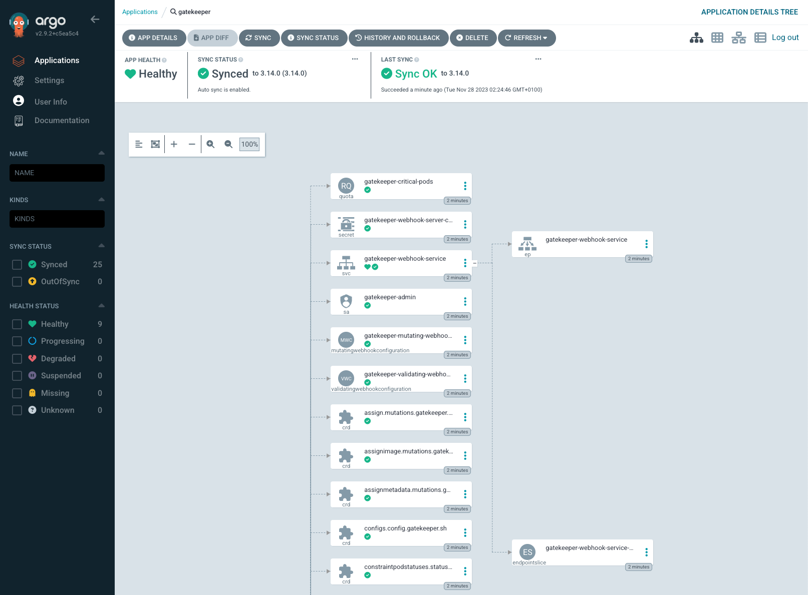

# OPA Gatekeeper

## ¿Qué es OPA?

[OPA](https://www.openpolicyagent.org/) significa Open Policy Agent. Proporciona control  basado en políticas para entornos nativos de la nube. Se trata de un proyecto de software de código abierto gestionado por la [Cloud Native Computing Foundation (CNCF)](https://www.cncf.io/).

OPA utiliza el lenguaje [Rego](https://www.openpolicyagent.org/docs/latest/policy-language/) para la definición de las políticas.

## ¿Qué es Gatekeeper?

[OPA Gatekeeper](https://open-policy-agent.github.io/gatekeeper) es un proyecto que proporciona una integración entre OPA y Kubernetes. Antes de Gatekeeper, se utilizaba el sidecar `kube-mgmt` (también conocido como Gatekeeper v1.0) para desplegar OPA en Kubernetes.

## Creación de un cluster de Kubernetes con [kind](https://kind.sigs.k8s.io/)

Para la creación de un cluster de Kubernetes con [kind](https://kind.sigs.k8s.io/) creamos un fichero `kind-gatekeeper-config.yaml` con la definición del cluster:

```yaml
kind: Cluster
apiVersion: kind.x-k8s.io/v1alpha4
nodes:
- role: control-plane
- role: worker
- role: worker
```

Después, ejecutamos el siguiente comando:

```bash
kind create cluster --name gatekeeper --config kind-gatekeeper-config.yaml
```

## Instalación de [Argo CD](https://argo-cd.readthedocs.io/en/stable/)

Para la instalación de [Argo CD](https://argo-cd.readthedocs.io/en/stable/), ejecutamos los siguientes comandos:

```bash
kubectl config use-context kind-gatekeeper
helm repo add argo https://argoproj.github.io/argo-helm
helm install argocd argo/argo-cd --namespace argocd --create-namespace
```

Para acceder al interfaz de usuario de Argo CD, ejecutamos el siguiente comando:

```bash
kubectl port-forward svc/argocd-server -n argocd 8080:443
```

Este último comando nos permitirá acceder al interfaz web a través de [https://localhost:8080](https://localhost:8080/). El usuario es `admin` y la contraseña se puede obtener con el siguiente comando:

```bash
kubectl get secret -n argocd argocd-initial-admin-secret -ojsonpath="{.data.password}" | base64 -d ; echo
```

## Instalación de Gatekeeper

Tenemos tres opciones para la instalación de Gatekeeper:

### Usando kubectl

```bash
kubectl apply -f https://raw.githubusercontent.com/open-policy-agent/gatekeeper/master/deploy/gatekeeper.yaml
```

### Usando Helm

```bash
helm repo add gatekeeper https://open-policy-agent.github.io/gatekeeper/charts
helm install gatekeeper/gatekeeper --name-template=gatekeeper --namespace gatekeeper-system --create-namespace
```

### Usando Argo CD

Creamos una Application Argo CD que podemos llamar `gatekeeper-application.yaml`:

```yaml
apiVersion: argoproj.io/v1alpha1
kind: Application
metadata:
  name: gatekeeper
  namespace: argocd
spec:
  project: default
  source:
    chart: gatekeeper
    repoURL: https://open-policy-agent.github.io/gatekeeper/charts
    targetRevision: 3.14.0
    helm:
      releaseName: gatekeeper
  destination:
    server: https://kubernetes.default.svc
    namespace: gatekeeper-system
  syncPolicy:
    automated: {}
    syncOptions:
    - CreateNamespace=true
```

Después, ejecutamos el siguiente comando:

```bash
kubectl create -f gatekeeper-application.yaml
```

Tras la creación de la Application, podemos visualizar su estado en el interfaz web de Argo CD:



También podemos ver el estado de la aplicación Argo CD con el siguiente comando:

```bash
kubectl get app gatekeeper -nargocd
```

## OPA Gatekeeper Library

La librería consta de dos componentes principales: Validación y Mutación.

- Validación: Gatekeeper puede validar los recursos en el cluster contra las políticas de validación de Gatekeeper. Las políticas se definen como `ConstraintTemplates` y `Constraints`. Las `ConstraintTemplates` se pueden aplicar directamente a un cluster y luego las `Constraints` se pueden aplicar para personalizar la política y adaptarla a sus necesidades específicas.
- Mutación: Gatekeeper puede mutar recursos en el cluster contra las políticas de mutación de Gatekeeper. Las políticas de mutación son sólo ejemplos y deben ser personalizadas para satisfacer sus necesidades antes de ser aplicadas.

Hay muchas políticas con ejemplos de como usarlas en https://open-policy-agent.github.io/gatekeeper-library/website/.

## Despliegue de políticas

Creamos una Application Argo CD que podemos llamar `gatekeeper-policies-application.yaml`:

```yaml
apiVersion: argoproj.io/v1alpha1
kind: Application
metadata:
  name: gatekeeper-policies
  namespace: argocd
spec:
  project: default
  source:
    repoURL: https://github.com/jarfernandez/opa-gatekeeper
    targetRevision: main
    path: policies
    directory:
      recurse: true
  destination:
    server: https://kubernetes.default.svc
    namespace: gatekeeper-system
  syncPolicy:
    automated: {}
```

Después, ejecutamos el siguiente comando:

```yaml
kubectl create -f gatekeeper-policies-application.yaml
```

**IMPORTANTE:** Si vas a desplegar `ConstraintTemplates` y `Constraints` con Argo CD utilizando la Application Argo CD anterior, debes incluir la siguiente anotación en los manifiestos de las `Constraints`:

```yaml
  annotations:
    argocd.argoproj.io/sync-options: SkipDryRunOnMissingResource=true
```

Tras la creación de la Application, podemos visualizar su estado en el interfaz web de Argo CD:


## Ejemplos de políticas

- Asegurar que se incluyen requests/limits
- Limitar el número de réplicas
- Bloquear/permitir repositorios de imágenes
- Bloquear contenedor privilegiado
- Bloquear escalada de privilegios
- Restringir los usuarios permitidos
- Asegurar solo lectura en el sistema de archivos raíz
- Asegurar configuración de probes

### Required Resources

Requiere que los contenedores tengan definidos requests/limits ([https://kubernetes.io/docs/concepts/configuration/manage-resources-containers/](https://kubernetes.io/docs/concepts/configuration/manage-resources-containers/)).

Template: [https://open-policy-agent.github.io/gatekeeper-library/website/validation/containerresources#template](https://open-policy-agent.github.io/gatekeeper-library/website/validation/containerresources#template)

Constraint:

```yaml
apiVersion: constraints.gatekeeper.sh/v1beta1
kind: K8sRequiredResources
metadata:
  name: container-must-have-cpu-requests-memory-limits-and-requests
  annotations:
    argocd.argoproj.io/sync-options: SkipDryRunOnMissingResource=true
spec:
  match:
    kinds:
      - apiGroups: [""]
        kinds: ["Pod"]
  parameters:
    limits:
      - memory
    requests:
      - cpu
      - memory
```

Esto es lo que ocurre cuando se quiere crear un nuevo pod sin requests de cpu y memoria y sin límites de memoria:

```yaml
kubectl run nginx --image=nginx
Error from server (Forbidden): admission webhook "validation.gatekeeper.sh" denied the request: [container-must-have-cpu-requests-memory-limits-and-requests] container <nginx> does not have <{"cpu", "memory"}> requests defined
[container-must-have-cpu-requests-memory-limits-and-requests] container <nginx> does not have <{"memory"}> limits defined
```

**IMPORTANTE:** Una `Constraint` se puede refinar para excluir determinados objetos por namespace, nombre o etiqueta: [https://open-policy-agent.github.io/gatekeeper/website/docs/howto/#the-match-field](https://open-policy-agent.github.io/gatekeeper/website/docs/howto/#the-match-field)

```yaml
apiVersion: constraints.gatekeeper.sh/v1beta1
kind: K8sRequiredResources
metadata:
  name: container-must-have-cpu-requests-memory-limits-and-requests
  annotations:
    argocd.argoproj.io/sync-options: SkipDryRunOnMissingResource=true
spec:
  match:
    kinds:
      - apiGroups: [""]
        kinds: ["Pod"]
    labelSelector:
      matchExpressions:
        - key: "debug"
          operator: NotIn
          values:
            - "true"
  parameters:
    limits:
      - memory
    requests:
      - cpu
      - memory
```

### Replica Limits

Requiere que los objetos con el campo `spec.replicas` (Deployments, ReplicaSets, etc.) especifiquen un número de réplicas dentro de unos rangos definidos.

Template: [https://open-policy-agent.github.io/gatekeeper-library/website/validation/replicalimits#template](https://open-policy-agent.github.io/gatekeeper-library/website/validation/replicalimits#template)

Constraint:

```yaml
apiVersion: constraints.gatekeeper.sh/v1beta1
kind: K8sReplicaLimits
metadata:
  name: replica-limits
  annotations:
    argocd.argoproj.io/sync-options: SkipDryRunOnMissingResource=true
spec:
  match:
    kinds:
      - apiGroups: ["apps"]
        kinds: ["Deployment"]
  parameters:
    ranges:
    - min_replicas: 3
      max_replicas: 10
```

Esto es lo que ocurre cuando se quiere crear un nuevo deployment con un número de réplicas fuera del rango definido en la `Constraint`.

```yaml
kubectl create deployment nginx --image=nginx --replicas=2
error: failed to create deployment: admission webhook "validation.gatekeeper.sh" denied the request: [replica-limits] The provided number of replicas is not allowed for Deployment: nginx. Allowed ranges: {"ranges": [{"max_replicas": 10, "min_replicas": 3}]}
```

### Privileged Container

Controla la capacidad de cualquier contenedor para habilitar el modo privilegiado. Corresponde al campo `privileged` en una PodSecurityPolicy. Para más información, ver [https://kubernetes.io/docs/concepts/policy/pod-security-policy/#privileged](https://kubernetes.io/docs/concepts/policy/pod-security-policy/#privileged)

Template: [https://open-policy-agent.github.io/gatekeeper-library/website/validation/privileged-containers/#template](https://open-policy-agent.github.io/gatekeeper-library/website/validation/privileged-containers/#template)

Constraint:

```yaml
apiVersion: constraints.gatekeeper.sh/v1beta1
kind: K8sPSPPrivilegedContainer
metadata:
  name: psp-privileged-container
  annotations:
    argocd.argoproj.io/sync-options: SkipDryRunOnMissingResource=true
spec:
  match:
    kinds:
      - apiGroups: [""]
        kinds: ["Pod"]
    excludedNamespaces: ["kube-system"]
```

## Enlaces

OPA: [https://www.openpolicyagent.org/](https://www.openpolicyagent.org/)

Repositorio OPA en GitHub: [https://github.com/open-policy-agent](https://github.com/open-policy-agent)

Gatekeeper: [https://open-policy-agent.github.io/gatekeeper/website/](https://open-policy-agent.github.io/gatekeeper/website/)

Repositorio Gatekeeper en GitHub: [https://github.com/open-policy-agent/gatekeeper](https://github.com/open-policy-agent/gatekeeper)

Instalación de Gatekeeper: [https://open-policy-agent.github.io/gatekeeper/website/docs/install/](https://open-policy-agent.github.io/gatekeeper/website/docs/install/)

Helm chart de Gatekeeper: [https://github.com/open-policy-agent/gatekeeper/tree/master/charts/gatekeeper](https://github.com/open-policy-agent/gatekeeper/tree/master/charts/gatekeeper)

Gatekeeper en el blog de Kubernetes: [https://kubernetes.io/blog/2019/08/06/opa-gatekeeper-policy-and-governance-for-kubernetes/](https://kubernetes.io/blog/2019/08/06/opa-gatekeeper-policy-and-governance-for-kubernetes/)

Instalación de Gatekeeper con Argo CD: [https://www.youtube.com/watch?v=EXu0rx0mtrM](https://www.youtube.com/watch?v=EXu0rx0mtrM)

Rego: [https://www.openpolicyagent.org/docs/latest/policy-language/](https://www.openpolicyagent.org/docs/latest/policy-language/)

OPA Gatekeeper Library:

- [https://open-policy-agent.github.io/gatekeeper-library/website/](https://open-policy-agent.github.io/gatekeeper-library/website/)
- [https://github.com/open-policy-agent/gatekeeper-library/tree/master/library](https://github.com/open-policy-agent/gatekeeper-library/tree/master/library)

Más sobre Gatekeeper:

- [https://medium.com/nerd-for-tech/opa-gatekeeper-on-kubernetes-69ca657c8631](https://medium.com/nerd-for-tech/opa-gatekeeper-on-kubernetes-69ca657c8631)
- [https://cloud.google.com/kubernetes-engine/docs/how-to/pod-security-policies-with-gatekeeper](https://cloud.google.com/kubernetes-engine/docs/how-to/pod-security-policies-with-gatekeeper)
- [https://tanzu.vmware.com/developer/guides/gs-opa-gatekeeper/](https://tanzu.vmware.com/developer/guides/gs-opa-gatekeeper/)
